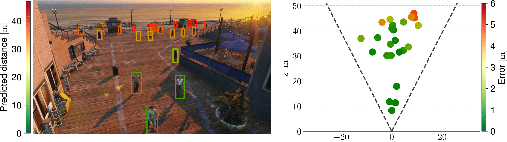

# Per-Object Distance Estimation from Monocular Images

Among past and novel challenges, the Computer Vision community has a long-standing commitment for **3D visual perception**, *i.e.*, seeing the surrounding environment in all three spatial dimensions (including **depth**). In this respect, humans continuously practice such a capability in everyday life: for example, when approaching a stop sign, the driver visually assesses the remaining distance to the sign and adjusts the car’s velocity accordingly. Such a simple scenario suggests the importance of a reliable 3D automatic perception, especially for AI systems dealing with autonomous driving and video surveillance applications.

While many researchers focused on popular tasks such as object detection and segmentation, a few efforts have been spent on object-specific distance estimation. Herein, the **goal** is to estimate the distance of a target object from the camera when it is projected onto the image plane. Pioneer works accomplished it with the pinhole model and the standard projective transformation; unfortunately, these approaches are viable only in static scenarios and suffer from radial lens distortion, hindering the estimation for objects located far from the center.

## Recent approaches

Instead, modern approaches rely either on **geometric** and **feature-based strategies**. The former [2,3,6] treat the problem as a **regression task** and attempt to learn the relationship, expected to be roughly linear, between the visual size of an object (such as the height of its bounding box) and its distance. In contrast, **feature-based** approaches [4,5,7] exploit deep learning architectures (e.g., Convolutional Neural Network) and incorporate visual cues of the target object, as well as global information related to the scene.
## The project


The scope of this project is to investigate and propose an approach for per-object distance estimation given a single image. In more details, the focus of the project is on outdoor urban scenarios: namely, the images come from a security camera filming a public place (e.g., a square or a street), with moving pedestrians and cars. Due to privacy concerns, the project relies on synthetic data only and specifically on **MOTSynth** [1], a recently released synthetic dataset for pedestrian detection, tracking, and segmentation. To help the students, the bounding boxes of the objects of interests (i.e., pedestrians) will be provided at both training and evaluation time, along with the entire original image.


To allow the students to assess the merits of their proposals, a ready-to-use codebase for both training and evaluation purpose will be released. Moreover, two simple approaches will be provided as baselines:

- **DisNet** [3], a simple regression-like approach based on Multi Layer Perceptrons (MLPs) that is fed with the relative width, height, and diagonal of bounding boxes. These features are then concatenated with three corresponding reference values (set to 175 cm, 55 cm, and 30 cm).
- The architecture proposed by **Zhu et al.** [7], which relies on ResNet as feature extractor and RoI pooling to build object-level representations.

The following are just some of the possible directions that the students could investigate:

- The exploitation of modern architectures, such as Graph Neural Networks (GNNs), Vision Transformers (VITs), Swin, and DeIT.
- The exploitation of self-supervised training techniques, such as Masked Autoencoders (MAEs).
- The adoption of techniques of model compression to reduce the computational footprint required at inference time.

## Executing the code
1. Create environment
```bash
    conda create -n <ENV_NAME> python=3.10
    conda activate <ENV_NAME>
    pip install -r requirements.txt
```

2. Execute code
- Zhu et al. [7]
```
python main.py --model zhu --backbone resnet34 --regressor simple_roi --batch_size 4 --input_h_w 720 1280 --train_sampling_stride 50 --lr 5e-05 --loss l1 [OPTIONAL --debug]
```
- Disnet [3]
```
python main.py --model disnet --batch_size 256 --train_sampling_stride 50 --lr 5e-05
```

## References

[1] Fabbri, Matteo, et al. “Motsynth: How can synthetic data help pedestrian detection and tracking?.” Proceedings of the IEEE/CVF International Conference on Computer Vision. 2021.

[2] Gökçe, Fatih, et al. “Vision-based detection and distance estimation of micro unmanned aerial vehicles.” Sensors 15.9 (2015): 23805-23846.

[3] Haseeb, Muhammad Abdul, et al. “DisNet: a novel method for distance estimation from monocular camera.” 10th Planning, Perception and Navigation for Intelligent Vehicles (PPNIV18), IROS (2018).

[4] Jing, Longlong, et al. “Depth estimation matters most: improving per-object depth estimation for monocular 3D detection and tracking.” 2022 International Conference on Robotics and Automation (ICRA). IEEE, 2022.

[5] Li, Yingwei, et al. “R4D: Utilizing Reference Objects for Long-Range Distance Estimation.” arXiv preprint arXiv:2206.04831 (2022).

[6] Tuohy, Shane, et al. “Distance determination for an automobile environment using inverse perspective mapping in OpenCV.” (2010): 100-105.

[7] Zhu, Jing, and Yi Fang. “Learning object-specific distance from a monocular image.” Proceedings of the IEEE/CVF International Conference on computer vision. 2019.
